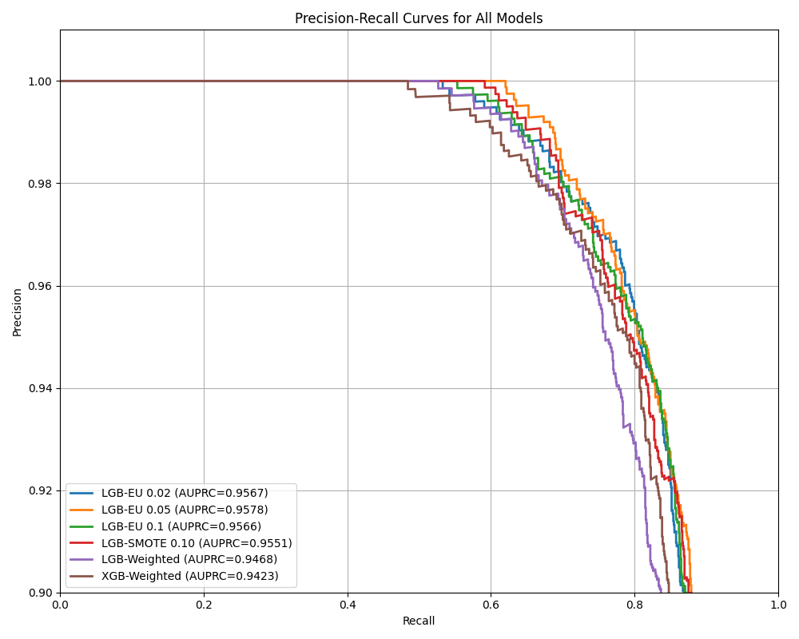

[](LICENSE)
[](https://www.python.org/)

# Fraud Detection in Financial Transactions
***Real-time LightGBM ensemble + SDV streaming + FastAPI dashboard.***

This project builds, tunes, and evaluates multiple machine learning models for credit card fraud detection using the open-source **BankSim** dataset. It includes synthetic data generation, feature engineering, class imbalance strategies, and model deployment components.

---

## Table of Contents

1. [Overview](#overview)
   * [Quick Start](#quick-start)
   * [Highlights](#highlights)
2. [Requirements](#requirements)
3. [Project Structure](#project-structure)
4. [Setup](#setup)
   * [Basic Setup](#basic-setup)
   * [Using the Package](#using-the-package)
   * [Available Tools](#available-tools)
5. [Methodology](#methodology)
   * [Dataset](#dataset)
   * [Feature Engineering](#feature-engineering)
   * [Modeling Approaches](#modeling-approaches)
   * [Evaluation](#evaluation)
     * [Precision-Recall Curves (All Models)](#precision-recall-curves-all-models)
     * [ROC Curves (All Models)](#roc-curves-all-models)
6. [Model Performance – LightGBM Ensemble (EU 0.05)](#model-performance--lightgbm-ensemble-eu-005)
   * [AUROC vs AUPRC Summary](#auroc-vs-auprc-summary)
   * [Calibration & Confusion Matrix](#calibration--confusion-matrix)
   * [Feature Importance](#feature-importance)
7. [Scoring API](#scoring-api)
8. [Real-Time Working POC](#real-time-working-poc)
9. [Synthetic Data Generation](#synthetic-data-generation)
10. [Dashboard](#dashboard)
11. [License](#license)
12. [References](#references)
13. [Contributors](#contributors)

---

## Overview

Fraud detection is a rare-event classification problem with high costs for false negatives. We build and benchmark four modeling pipelines on the **BankSim** dataset.

This project systematically compares four modeling approaches, all grounded in domain-informed behavioral features and tailored class imbalance strategies.

### Quick Start

```bash
pip install -r requirements.txt
python tools/run_demo.py
```

---


### Highlights

- Evaluated multiple classifiers — including Logistic Regression, Random Forest, XGBoost, and LightGBM — before finalizing **a tuned LightGBM ensemble with a 0.05 undersampling ratio**, which achieved the best balance of precision, recall, and latency.
- Engineered 39 behavioral and temporal features such as rolling z-scores, transaction velocity, and customer–merchant familiarity.
- Compared **four imbalance-aware techniques**:
  1. Weighted LightGBM (Optuna-tuned)
  2. Easy-negative undersampled LightGBM ensemble (×5)
  3. SMOTE + LightGBM
  4. Weighted XGBoost (Optuna-tuned)
- Models evaluated on **out-of-time splits**, using AUPRC and AUROC as primary metrics.
- Deployment includes a real-time **FastAPI scoring endpoint** and a **Streamlit dashboard** for monitoring.

---


## Project Structure
```text
banksim-fraud/
├── assets/                       # Stored images, plots for reports/dashboards
├── data/                         # Raw and processed data (BankSim CSVs)
│   ├── bs140513_032310.csv
│   ├── live_scored_txns.csv      # Live scored output
│   └── synthetic_txns.csv        # Synthetic data generated via SDV
├── models/                       # Trained ML model artifacts
├── src/
│   └── banksim_fraud/
│       ├── api.py                # FastAPI scoring app
│       ├── cli.py                # CLI entry points
│       ├── config.py             # Global settings
│       ├── features.py           # Feature engineering pipeline
│       ├── __init__.py
│       └── model.py              # Model loading & prediction logic
├── tools/
│   ├── dashboard.py              # Streamlit dashboard
│   ├── feature_saver.py          # Save final features to JSON
│   ├── generate_synthetic_data.py# Generate synthetic transactions
│   ├── model_comparison.py       # Compare models and output scores
│   ├── plot_model_scores.py      # Generate AUROC/AUPRC plots
│   ├── run_demo.py               # Launch API, streamer, dashboard
│   └── stream_and_score.py       # Stream synthetic txns to API
│   └── feature_imp_extractor.py  # Tool to extract the important gain based features from best model
├── .gitignore
└── requirements.txt

```


### Requirements
* Python: 3.9 or later

* Key dependencies:

  * LightGBM – gradient boosting model

  * XGBoost – gradient boosting model

  * Optuna – hyperparameter optimization

  * imbalanced-learn – SMOTE, undersampling

  * scikit-learn – ML utilities & metrics

  * SDV – synthetic data generation

  * FastAPI – API framework

  * Streamlit – dashboard visualization

  * pandas, numpy – data handling

  * matplotlib – plotting

---


### Setup

To run the BankSim fraud detection system locally, follow these steps:

#### Basic Setup

1. Clone the Repository

```
git clone https://github.com/yourname/banksim-fraud.git
cd banksim-fraud
```

2. Install Python Dependencies

```
pip install -r requirements.txt
```

3. Install package for usage

```
pip install -e .
```
#### Using the Package

1. Training Models

```
banksim-train {banksim-dataset-path}
```

This command trains all models, saves them to models/.

#### Available Tools

| Script                             | Description                                                                                |
| ---------------------------------- | ------------------------------------------------------------------------------------------ |
| `tools/feature_saver.py`           | Saves final model features to `models/features.json` for inference-time schema validation. |
| `tools/generate_synthetic_data.py` | Generates synthetic BankSim-like transactions using **GaussianCopula** (via SDV).          |
| `tools/model_comparison.py`        | Evaluates all models and writes `model_scores.csv` for metric comparison.                  |
| `tools/plot_model_scores.py`       | Creates AUPRC, AUROC, and bar charts from model scores. Output saved in `assets/images/`.  |
| `tools/run_demo.py`                | Runs the full system: API, Streamlit dashboard, and streaming simulation.                  |
| `tools/stream_and_score.py`        | Simulates real-time transactions and streams them to the `/score` endpoint.                |
| `tools/feature_imp_extractor.py`   | Tool to extract the important gain based features from best model.                         |                 

Example: Run the Full End-to-End Demo
``` bash
python tools/run_demo.py
```
This will:

* Start the FastAPI scoring service at http://localhost:8000/score
* Launch the Streamlit dashboard at http://localhost:8501
* Begin real-time scoring using stream_and_score.py


## Methodology


### Dataset
We use the BankSim dataset — an agent-based simulation of real-world financial transactions — as the foundation for training and evaluating our fraud detection models.
Original paper: López-Rojas & Axelsson (2014) — BankSim: A bank payment simulation for fraud detection research. [BankSim Dataset on Kaggle](https://www.kaggle.com/datasets/ealaxi/banksim1/data)


Data format: CSV file (bs140513_032310.csv) with ~594,000 transaction records.

#### Schema
Each row represents a single transaction with the following fields:

| Column        | Description                                  |
|---------------|----------------------------------------------|
| step          | Hour of simulation (1–740)                   |
| customer      | Unique anonymized customer ID                |
| merchant      | Unique anonymized merchant ID                |
| age           | Customer age group                           |
| gender        | Customer gender (M/F)                        |
| category      | Transaction category/type                    |
| amount        | Transaction amount in currency units         |
| zipcodeOri    | Origin ZIP code                              |
| zipMerchant   | Merchant ZIP code                            |
| fraud         | Fraud flag (1 = fraud, 0 = legitimate)       |

The dataset is highly imbalanced:

* Fraud rate: approximately 1.2%

* No missing values.


### Feature Engineering

Our feature engineering strategy aimed to transform the raw transaction logs into semantically meaningful, behavior-aware attributes that reflect temporal trends, entity relationships, and situational anomalies.

We grouped features into the following categories:

Temporal Features:

* `amount_zscore_24h`: How unusual the current amount is compared to 24h history
* `txn_count_24h`, `mean_amount_24h`: Short-term velocity and average size of transactions
* `step_delta`: Time since the previous transaction (customer-based)

Customer–Merchant Interaction Features:

* `merchant_occurrences`: Number of past transactions with this merchant
* `is_first_time_pair`: Binary flag indicating first-time interaction
* `unique_merchants_count`: Diversity of merchants per customer

Time-of-Day Feature:

* `is_night`: Flag for transactions between 00:00–06:00, a common fraud window

Encoded Categorical Fields:

* One-hot encoding applied to `category`, `gender`, `age`

Implementation was handled in `features.py` using efficient `groupby` operations with rolling windows. Care was taken to prevent **data leakage**—only historical data up to the current transaction was used to compute feature values. The final feature matrix was designed for compatibility with both batch and streaming inference.

### Modeling Approaches

We explored four modeling approaches, each designed to address the severe class imbalance (\~1.2% fraud) in the BankSim dataset, and optimized for high precision-recall tradeoffs:

#### 1. Weighted LightGBM (Baseline)

* Trained on full data using `scale_pos_weight = n_nonfraud / n_fraud`
* Objective: binary classification with custom Optuna tuning (20–50 trials)
* Strengths: simple, efficient, avoids overfitting to synthetic samples

#### 2. Easy-Negative Undersampling Ensemble (EU-LGBM ×5)

* Used `RandomUnderSampler` to sample legitimate transactions at 0.02–0.10 ratio
* Trained 5 LightGBM models on different bootstrapped subsets
* Final prediction: average of model outputs
* Strengths: improves recall by reducing majority dominance, ensemble mitigates variance

#### 3. SMOTE + LightGBM

* Applied **SMOTE** to synthesize frauds up to 10% positive class ratio
* Trained a single LGBM on the oversampled dataset
* Tradeoff: improves sensitivity but may distort real-world decision boundaries

#### 4. Weighted XGBoost

* Applied `scale_pos_weight` and optimized `aucpr` objective via Optuna
* Includes regularization to mitigate overfitting
* Strengths: native class weighting, robust performance on tabular data

All models used the same feature matrix and strict **out-of-time split** (step ≤ 600 for train, >600 for test) to simulate production deployment scenarios.

### Evaluation

We conducted a thorough evaluation of all models using the holdout test set (step > 600), focusing on rare-event detection performance. Key metrics included:

* **AUPRC (Area Under Precision-Recall Curve)** – preferred for imbalanced classification
* **AUROC** – overall discriminative power
* **Precision\@k** – relevance among top-k alerts
* **Recall @ 0.1% FPR** – sensitivity when false positives are tightly constrained

| Model          | AUPRC  | AUROC  |
| -------------- | ------ | ------ |
| LGB-EU 0.05    | 0.9578 | 0.9993 |
| LGB-EU 0.02    | 0.9567 | 0.9993 |
| LGB-EU 0.10    | 0.9566 | 0.9993 |
| LGB-SMOTE 0.10 | 0.9551 | 0.9993 |
| LGB-Weighted   | 0.9468 | 0.9991 |
| XGB-Weighted   | 0.9423 | 0.9988 |

Each model’s predictions were saved and analyzed using a set of visual tools (in `assets/images/`):

* **ROC and PR curves** for both individual and comparative views
* **Calibration curves** to inspect score reliability
* **Confusion matrices** at operating thresholds
* **Feature importance plots** for model explainability

---

#### Precision-Recall Curves (All Models)



All models perform well, but the LightGBM ensemble models
(especially at 0.02 and 0.05 sampling) show slightly superior AUPRC.
This metric better reflects model quality under extreme class imbalance by
highlighting the tradeoff between capturing fraud and avoiding false alarms.

---

#### ROC Curves (All Models)


The ROC curves for all models are tightly packed near the top-left corner, indicating excellent separation between fraud and non-fraud. Despite this, ROC alone can overstate performance in imbalanced datasets—hence the focus on AUPRC in our selection process.

---


## Model Performance – LightGBM Ensemble (EU 0.05)

This section focuses on performance analysis of the **best model**: the LightGBM Ensemble with a 0.05 undersampling ratio.

### AUROC vs AUPRC Summary


This scatter plot visually confirms that the selected model achieves the **best balance** between recall (AUROC) and precision (AUPRC), which is crucial in identifying rare fraudulent events while minimizing false alerts.

This model offers the best precision-recall tradeoff, meaning it can detect most fraudulent transactions without overwhelming false positives. The ROC curve confirms its ability to distinguish between classes across thresholds with near-perfect accuracy.

* **AUROC:** 0.9993
* Combines high recall with extremely low false positive rate.

---


### Calibration & Confusion Matrix


The calibration curve shows that predicted fraud probabilities are well-aligned with observed outcomes—indicating well-calibrated confidence scores. The confusion matrix validates that the model **captures most fraud cases** while keeping false positives **very low**.

---

### Feature Importance


* Derived from LightGBM’s built-in gain metric.
* Highlights features like `amount_zscore_24h`, `txn_count_24h`, and `is_first_time_pair` as top predictors.

Fraud decisions rely heavily on behavioral changes—such as sudden spikes in transaction value, unusual activity volume, or first-time customer–merchant interactions. This aligns with fraud domain insights and boosts model interpretability.

---
### Scoring API

To support low-latency, production-ready inference, we developed a **FastAPI-based prediction server** (`api.py`) that exposes a RESTful `/score` endpoint. It accepts JSON payloads with transaction data and returns the probability of fraud.

* **Model Loading**: Reads LightGBM booster from `models/`
* **Feature Consistency**: Ensures incoming features match `features.json` schema
* **Validation**: Performs type and range checks before prediction

Example request:

```json
{
  "customer": "C123456789",
  "merchant": "M987654321",
  "amount": 49.99,
  "step": 634,
  ...
}
```


Models are loaded from the `models/` directory. Feature validation is performed using `features.json`. The system supports sub-10ms latency (95th percentile).

---

## Real-Time Working POC

The Real-Time Working Proof of Concept (POC) demonstrates the end-to-end functionality of our fraud detection pipeline in a live environment.  
It integrates the **FastAPI scoring service**, **synthetic data streamer**, and **Streamlit monitoring dashboard** to replicate a real-world fraud detection workflow.

In this setup:
- **Synthetic transactions** are continuously generated and streamed to the API.
- The **API** applies the trained LightGBM ensemble model to score each transaction in real time.
- Predictions are logged and instantly visualized in the **dashboard**, providing actionable insights into fraud trends, score distributions, and live transaction activity.

This POC validates that the system can operate under real-world constraints—handling streaming data, low-latency inference, and dynamic visualization—making it ready for production deployment.


---

### Synthetic Data Generation

To simulate a real-time transaction environment and test our pipeline under varying conditions, we utilized the **SDV (Synthetic Data Vault)** library. This toolkit is well-suited for generating tabular data with similar statistical properties as a given dataset—in our case, the original BankSim dataset.

Synthetic data generation served two key purposes:

* **Stress-testing the deployed API** by simulating streaming traffic
* **Augmenting the dataset** to evaluate robustness across varying class distributions

The synthetic dataset retained the same schema as the original but allowed custom control over volume and sampling variability.

**Command-line example:**

```bash
python tools/generate_synthetic_data.py \
  --input data/bs140513_032310.csv \
  --output data/synthetic_txns.csv \
  --rows 50000
```

Generated records were streamed using the `stream_and_score.py` utility to test real-time scoring capabilities and visualize predictions live in the dashboard.


## Dashboard

The interactive fraud monitoring dashboard is built using Streamlit and provides real-time visual feedback on model predictions and fraud alerts.

You can launch the complete system—including the API, streamer, and dashboard—using a single command:

```
python tools/run_demo.py
```
This script orchestrates:

* A FastAPI scoring service (src/banksim_fraud/api.py)

* A synthetic streaming engine (tools/stream_and_score.py)

* A Streamlit dashboard for visualizing fraud predictions (tools/dashboard.py)


---

## License
This project is licensed under the MIT License – see [LICENSE](LICENSE) for details.

---

## References

1. López-Rojas, E. A., & Axelsson, S. (2014). BankSim: A bank payment simulation for fraud detection research. In Proceedings of the 26th European Modeling & Simulation Symposium (EMSS), 249–255.

2. Chawla, N. V., Bowyer, K. W., Hall, L. O., & Kegelmeyer, W. P. (2002). SMOTE: Synthetic Minority Over-sampling Technique. Journal of Artificial Intelligence Research, 16, 321–357.

3. Chen, T., & Guestrin, C. (2016). XGBoost: A scalable tree boosting system. Proceedings of the 22nd ACM SIGKDD International Conference on Knowledge Discovery and Data Mining, 785–794.

4. Ke, G., Meng, Q., Finley, T., Wang, T., Chen, W., Ma, W., Ye, Q., & Liu, T.-Y. (2017). LightGBM: A highly efficient gradient boosting decision tree. Advances in Neural Information Processing Systems, 30.

5. Prokhorenkova, L., Gusev, G., Vorobev, A. V., Dorogush, A. V., & Gulin, A. (2018). CatBoost: Unbiased boosting with categorical features. Advances in Neural Information Processing Systems, 31.

6. Dou, Y., Liu, Z., Sun, L., Deng, Y., Peng, H., & Yu, P. S. (2020). Enhancing graph neural network-based fraud detectors against camouflaged fraudsters. Proceedings of the 29th ACM International Conference on Information & Knowledge Management, 315–324.

---

## Contributors
This project was developed by:

Mani Jose – manijosevg@gmail.com

Nakul Krishna R – nakulkrishna96@gmail.com

Special thanks to the maintainers of LightGBM, XGBoost, Optuna, Imbalanced-Learn, and Streamlit, whose open-source contributions made this work possible.

---
