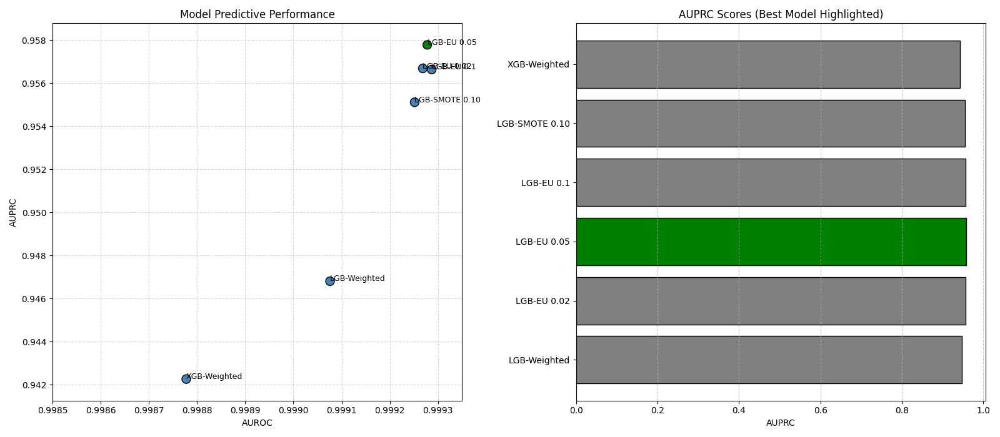

# Fraud Detection in Financial Transactions

This project builds, tunes, and evaluates multiple machine learning models for credit card fraud detection using the open-source **BankSim** dataset. It includes synthetic data generation, feature engineering, class imbalance strategies, and model deployment components.

---

## Table of Contents

1. [Overview](#overview)
2. [Literature Review](#literature-review)
3. [Project Structure](#project-structure)
4. [Installation](#installation)
5. [Methodology](#methodology)

    * [Synthetic Data](#synthetic-data)
    * [Feature Engineering](#feature-engineering)
    * [Modeling Approaches](#modeling-approaches)
    * [Evaluation](#evaluation)
    * [Scoring API](#scoring-api)
6. [Live Dashboard](#live-dashboard)
7. [Results](#results)
8. [Credits](#credits)

---

## Overview

Fraud detection is a rare-event classification problem with high costs for false negatives. We build and benchmark four modeling pipelines on the **BankSim** dataset.

This project tackles financial fraud detection as a rare-event classification task using the **BankSim** dataset. We systematically explored and compared four modeling approaches, all grounded in domain-informed behavioral features and tailored class imbalance strategies.

---

### Highlights:

* Evaluated multiple classifiers — including Logistic Regression, Random Forest, XGBoost, and LightGBM — before finalizing **a tuned LightGBM ensemble with a 0.02 undersampling ratio**, which achieved the best balance of precision, recall, and latency.
* Engineered 39 behavioral and temporal features such as rolling z-scores, transaction velocity, and customer–merchant familiarity using BankSim’s event log format.
* Compared **four imbalance-aware techniques**:

    1. Weighted LightGBM (Optuna-tuned)
    2. Easy-negative undersampled LightGBM ensemble (×5)
    3. SMOTE + LightGBM
    4. Weighted XGBoost (Optuna-tuned)
* All models evaluated on **out-of-time splits**, using AUPRC and AUROC as primary metrics.
* Final deployment includes a real-time **FastAPI scoring endpoint** and a **Streamlit dashboard** visualizing fraud scores as transactions stream in.

---

## Project Structure - mani
```text
banksim-fraud/
├── src/
│   └── banksim_fraud/
│       ├── api.py                 # FastAPI scoring service
│       ├── features.py            # Feature generation
│       ├── model.py               # Model I/O and prediction
│       └── config.py              # Paths, threshold, etc.
├── tools/
│   ├── dashboard.py               # Streamlit monitoring UI
│   ├── stream_and_score.py        # Synthetic stream → API
│   ├── run_demo.py                # Orchestrates all components
│   └── generate_synthetic_data.py # SDV-based data synthesis
├── models/                        # Trained models and schemas
├── data/                          # Raw, processed, and scored data
├── assets/                        # Images, plots, diagrams
├── requirements.txt
└── README.md
```

### Setup - mani

## Methodology

### Dataset

### Feature Engineering

Our feature engineering strategy aimed to transform the raw transaction logs into semantically meaningful, behavior-aware attributes that reflect temporal trends, entity relationships, and situational anomalies.

We grouped features into the following categories:

Temporal Features:

* `amount_zscore_24h`: How unusual the current amount is compared to 24h history
* `txn_count_24h`, `mean_amount_24h`: Short-term velocity and average size of transactions
* `step_delta`: Time since the previous transaction (customer-based)

Customer–Merchant Interaction Features:

* `merchant_occurrences`: Number of past transactions with this merchant
* `is_first_time_pair`: Binary flag indicating first-time interaction
* `unique_merchants_count`: Diversity of merchants per customer

Time-of-Day Feature:

* `is_night`: Flag for transactions between 00:00–06:00, a common fraud window

 Encoded Categorical Fields:

* One-hot encoding applied to `category`, `gender`, `age`

Implementation was handled in `features.py` using efficient `groupby` operations with rolling windows. Care was taken to prevent **data leakage**—only historical data up to the current transaction was used to compute feature values. The final feature matrix was designed for compatibility with both batch and streaming inference.

### Modeling Approaches

We explored four modeling approaches, each designed to address the severe class imbalance (\~1.2% fraud) in the BankSim dataset, and optimized for high precision-recall tradeoffs:

#### 1. Weighted LightGBM (Baseline)

* Trained on full data using `scale_pos_weight = n_nonfraud / n_fraud`
* Objective: binary classification with custom Optuna tuning (20–50 trials)
* Strengths: simple, efficient, avoids overfitting to synthetic samples

#### 2. Easy-Negative Undersampling Ensemble (EU-LGBM ×5)

* Used `RandomUnderSampler` to sample legitimate transactions at 0.02–0.10 ratio
* Trained 5 LightGBM models on different bootstrapped subsets
* Final prediction: average of model outputs
* Strengths: improves recall by reducing majority dominance, ensemble mitigates variance

#### 3. SMOTE + LightGBM

* Applied **SMOTE** to synthesize frauds up to 10% positive class ratio
* Trained a single LGBM on the oversampled dataset
* Tradeoff: improves sensitivity but may distort real-world decision boundaries

#### 4. Weighted XGBoost

* Applied `scale_pos_weight` and optimized `aucpr` objective via Optuna
* Includes regularization to mitigate overfitting
* Strengths: native class weighting, robust performance on tabular data

All models used the same feature matrix and strict **out-of-time split** (step ≤ 600 for train, >600 for test) to simulate production deployment scenarios.

### Evaluation

We conducted a thorough evaluation of all models using the holdout test set (step > 600), focusing on rare-event detection performance. Key metrics included:

* **AUPRC (Area Under Precision-Recall Curve)** – preferred for imbalanced classification
* **AUROC** – overall discriminative power
* **Precision\@k** – relevance among top-k alerts
* **Recall @ 0.1% FPR** – sensitivity when false positives are tightly constrained

| Model          | AUPRC  | AUROC  |
| -------------- | ------ | ------ |
| LGB-EU 0.05    | 0.9578 | 0.9993 |
| LGB-EU 0.02    | 0.9567 | 0.9993 |
| LGB-EU 0.10    | 0.9566 | 0.9993 |
| LGB-SMOTE 0.10 | 0.9551 | 0.9993 |
| LGB-Weighted   | 0.9468 | 0.9991 |
| XGB-Weighted   | 0.9423 | 0.9988 |

Each model’s predictions were saved and analyzed using a set of visual tools (in `assets/images/`):

* **ROC and PR curves** for both individual and comparative views
* **Calibration curves** to inspect score reliability
* **Confusion matrices** at operating thresholds
* **Feature importance plots** for model explainability

---

**🔸 Precision-Recall Curves (All Models)**


All models perform well, but the LightGBM ensemble models 
(especially at 0.02 and 0.05 sampling) show slightly superior AUPRC. 
This metric better reflects model quality under extreme class imbalance by 
highlighting the tradeoff between capturing fraud and avoiding false alarms.

---

**🔸 ROC Curves (All Models)**


The ROC curves for all models are tightly packed near the top-left corner, indicating excellent separation between fraud and non-fraud. Despite this, ROC alone can overstate performance in imbalanced datasets—hence the focus on AUPRC in our selection process.

We conducted a thorough evaluation of all models using the holdout test set (step > 600), focusing on rare-event detection performance. Key metrics included:

* **AUPRC (Area Under Precision-Recall Curve)** – preferred for imbalanced classification
* **AUROC** – overall discriminative power
* **Precision\@k** – relevance among top-k alerts
* **Recall @ 0.1% FPR** – sensitivity when false positives are tightly constrained

| Model          | AUPRC  | AUROC  |
| -------------- | ------ | ------ |
| LGB-EU 0.05    | 0.9578 | 0.9993 |
| LGB-EU 0.02    | 0.9567 | 0.9993 |
| LGB-EU 0.10    | 0.9566 | 0.9993 |
| LGB-SMOTE 0.10 | 0.9551 | 0.9993 |
| LGB-Weighted   | 0.9468 | 0.9991 |
| XGB-Weighted   | 0.9423 | 0.9988 |

Each model’s predictions were saved and analyzed using a set of visual tools (in `assets/images/`):

* **ROC and PR curves** for both individual and comparative views
* **Calibration curves** to inspect score reliability
* **Confusion matrices** at operating thresholds
* **Feature importance plots** for model explainability

---

### 🔹 PR Curves Of  Models




The ROC curve hugs the top-left corner, 
indicating near-perfect discrimination. 
The PR curve shows **very high precision even at full recall**, confirming that this model performs reliably in a production setting with class imbalance.


## Model Performance – LightGBM Ensemble (EU 0.05)

This section focuses on performance analysis of the **best model**: the LightGBM Ensemble with a 0.05 undersampling ratio.

### 🔹 AUROC vs AUPRC Summary


This scatter plot visually confirms that the selected model achieves the **best balance** between recall (AUROC) and precision (AUPRC), which is crucial in identifying rare fraudulent events while minimizing false alerts.

This model offers the best precision-recall tradeoff, meaning it can detect most fraudulent transactions without overwhelming false positives. The ROC curve confirms its ability to distinguish between classes across thresholds with near-perfect accuracy.

* **AUROC:** 0.9993
* Combines high recall with extremely low false positive rate.

---


### 🔹 Calibration & Confusion Matrix


The calibration curve shows that predicted fraud probabilities are well-aligned with observed outcomes—indicating well-calibrated confidence scores. The confusion matrix validates that the model **captures most fraud cases** while keeping false positives **very low**.

---

### 🔹 Feature Importance


* Derived from LightGBM’s built-in gain metric.
* Highlights features like `amount_zscore_24h`, `txn_count_24h`, and `is_first_time_pair` as top predictors.

Fraud decisions rely heavily on behavioral changes—such as sudden spikes in transaction value, unusual activity volume, or first-time customer–merchant interactions. This aligns with fraud domain insights and boosts model interpretability.

---
### Scoring API

To support low-latency, production-ready inference, we developed a **FastAPI-based prediction server** (`api.py`) that exposes a RESTful `/score` endpoint. It accepts JSON payloads with transaction data and returns the probability of fraud.

* **Model Loading**: Reads LightGBM booster from `models/`
* **Feature Consistency**: Ensures incoming features match `features.json` schema
* **Validation**: Performs type and range checks before prediction

Example request:

```json
{
  "customer": "C123456789",
  "merchant": "M987654321",
  "amount": 49.99,
  "step": 634,
  ...
}
```

Models are loaded from the `models/` directory. Feature validation is performed using `features.json`. The system supports sub-10ms latency (95th percentile).

---

## Real time working POC


(Existing content unchanged)

---

### Fast API POC

### Synthetic Data Generation

To simulate a real-time transaction environment and test our pipeline under varying conditions, we utilized the **SDV (Synthetic Data Vault)** library. This toolkit is well-suited for generating tabular data with similar statistical properties as a given dataset—in our case, the original BankSim dataset.

Synthetic data generation served two key purposes:

* **Stress-testing the deployed API** by simulating streaming traffic
* **Augmenting the dataset** to evaluate robustness across varying class distributions

The synthetic dataset retained the same schema as the original but allowed custom control over volume and sampling variability.

**Command-line example:**

```bash
python tools/generate_synthetic_data.py \
  --input data/bs140513_032310.csv \
  --output data/synthetic_txns.csv \
  --rows 50000
```

Generated records were streamed using the `stream_and_score.py` utility to test real-time scoring capabilities and visualize predictions live in the dashboard.


## Dashboard


## Credits

(Existing content unchanged)

Models are loaded from the `models/` directory. Feature validation is performed using `features.json`. The system supports sub-10ms latency (95th percentile).

---

## Credits

(Existing content unchanged)
